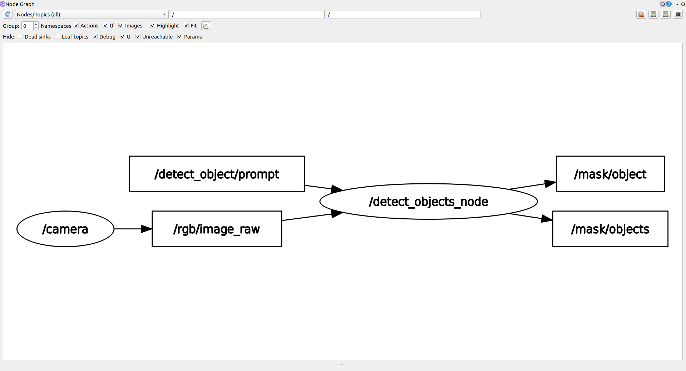

# Bridging Legacy and Modern Systems (ROS1 & SAM3)

Many robotics projects face a common dilemma: the need to integrate state-of-the-art AI models with legacy hardware and software systems. 

A classic example is using `ROS1 Noetic`, a robust framework that is often deeply tied to specific operating systems (like Ubuntu 20.04), older Python versions (Python 3.8), and hardware drivers that cannot be easily updated or migrated. On the other hand, modern AI tools like `Segment Anything Model 3` require modern Python environments, modern PyTorch installations, and newer dependencies.

Trying to install these modern tools into a legacy ROS1 environment usually results in dependency conflicts, broken packages, or simply unsupported library versions.

## The Problem with Other Solutions

### Why not just use Docker?
While Docker is a great tool for isolation, it introduces significant friction in a robotics development workflow:

1. **Hardware Passthrough Complexity**: Exposing GPUs, cameras, and specialized serial devices to a container can be tedious and sometimes unreliable.
2. **Network Overhead**: Configuring ROS networking (`ROS_MASTER_URI`, `ROS_IP`) across container boundaries adds unnecessary complexity.
3. **Development Cycle**: Rebuilding containers for every minor code change slows down rapid prototyping and debugging.

## The ZROS + uv Solution

By combining **ZROS** with a modern Python package manager like **[uv](https://github.com/astral-sh/uv)**, you can create a seamless, high-performance bridge between these two isolated environments on the same machine—without the overhead of Docker.

### How it works

1. **The Legacy Node (ROS1)**: Your main control loop, camera drivers, and hardware interfaces continue running in their native, unchanged ROS1 environment.
2. **The Modern Node (SAM3)**: Your cutting-edge AI model runs in a completely isolated, modern Python virtual environment managed by `uv`.
3. **The Bridge (ZROS)**: Both sides communicate asynchronously over `localhost` using ZROS.

<!--  -->
> *Placeholder: Image Diagram of the architecture*

---

## Example: Object Detection Bridge

Below is a real-world example of how to implement this architecture.

### 1. The Legacy Side (ROS1 Node)
This script runs in the system's ROS1 environment (e.g., Python 3.8). It subscribes to a ROS camera topic, receives a text prompt, and publishes the data via **ZROS** to the modern environment. When the modern environment replies with a segmentation mask, it converts it back to a standard ROS `Image` message.

```python title="scripts/detect_object.py"
#!/usr/bin/env python3
import rospy
import numpy as np
import threading
import subprocess

from sensor_msgs.msg import Image
from std_msgs.msg import String
from cv_bridge import CvBridge

# Import ZROS into the legacy environment
from zros import zNode, zCompressedCVBridge

class DetectObjects:
    def __init__(self):
        rospy.init_node('detect_objects_node')
        
        # ROS 1 Setup
        self.cv_bridge = CvBridge()
        self.current_frame = None
        self.current_header = None
        
        rospy.Subscriber('/detect_object/prompt', String, self.prompt_callback)
        rospy.Subscriber("/rgb/image_raw", Image, self.image_callback)
        self.mask_object_pub = rospy.Publisher("/mask/object", Image, queue_size=1)
        self.mask_objects_pub = rospy.Publisher("/mask/objects", Image, queue_size=1)

        # ZROS Setup (The Bridge)
        self.znode = zNode("ros_sam3")
        self.zcv_bridge = zCompressedCVBridge()
        self.z_pub = self.znode.create_publisher("sam3_bridge/ros")
        self.znode.create_subscriber("sam3_bridge/sam3", self.z_response_callback)
        
        self.z_thread = threading.Thread(target=self.znode.spin, daemon=True)
        self.z_thread.start()

    def image_callback(self, msg: Image):
        self.current_frame = self.cv_bridge.imgmsg_to_cv2(msg, "bgr8")

    def prompt_callback(self, msg: String):
        prompt = msg.data
        frame = self.current_frame
        if not prompt or frame is None: return

        rospy.loginfo(f"Processing prompt: '{prompt}'")
        
        # Package the prompt and the compressed image for ZROS
        msg_zros = {
            "prompt": prompt,
            "zimgmsg": self.zcv_bridge.cv2_to_zimgmsg(frame) # ZROS image message
        }
        self.z_pub.publish(msg_zros)

    def z_response_callback(self, msg: dict):
        status = msg["status"]

        if status == "success":
            # ZROS image message to OpenCV
            mask_object_cv2 = self.zcv_bridge.zimgmsg_to_cv2(msg["mask_object"])
            mask_objects_cv2 = self.zcv_bridge.zimgmsg_to_cv2(msg["mask_objects"])
            
            # OpenCV to ROS image message
            mask_object_msg = self.cv_bridge.cv2_to_imgmsg(mask_object_cv2, "mono8")
            mask_objects_msg = self.cv_bridge.cv2_to_imgmsg(mask_objects_cv2, "mono8")
            
            self.mask_object_pub.publish(mask_object_msg)
            self.mask_objects_pub.publish(mask_objects_msg)
            rospy.loginfo(f"Published masks (Conf: {msg['conf']:.2f})")
            
        elif status == "no_detection":
            # Publish empty masks
            empty_mask = np.zeros(self.current_frame.shape[:2], dtype=np.uint8)
            empty_msg = self.cv_bridge.cv2_to_imgmsg(empty_mask, "mono8")
            
            self.mask_object_pub.publish(empty_msg)
            self.mask_objects_pub.publish(empty_msg)
            rospy.loginfo("No objects detected.")

# Automatically boot up the isolated SAM3 environment using 'uv run'
def start_sam3():
    cmd = ["uv", "run", "--project", "sam3_bridge", "sam3_bridge/main.py"]
    return subprocess.Popen(cmd)

if __name__ == '__main__':
    start_sam3()
    node = DetectObjects()
    rospy.spin()
```

### 2. The Modern Side (SAM3 Environment)
This script runs in an isolated Python environment (managed automatically by `uv`) containing modern dependencies like `ultralytics` and PyTorch. Notice that this file has **zero dependencies on ROS**. It only talks to ZROS.

```python title="sam3_bridge/main.py"
import numpy as np, cv2
from ultralytics.models.sam import SAM3SemanticPredictor

# Import ZROS in the modern environment
from zros import zNode, zCompressedCVBridge

class SAM3InferenceServer(zNode):
    def __init__(self, imgsz=1092, half=False):
        super().__init__("sam3_ros")
        
        self.bridge = zCompressedCVBridge()

        # Load model
        self.predictor = SAM3SemanticPredictor(
            overrides=dict(
                task="segment",
                mode="predict",
                model="sam3.pt",
                imgsz=imgsz,
                half=half,
                conf=0.5,
                device="cuda",
                save=False
            )
        )
        print("SAM3 ready")
        
        self.sub = self.create_subscriber("sam3_bridge/ros", self.callback)
        self.pub = self.create_publisher("sam3_bridge/sam3")

    def callback(self, msg: dict):
        prompt = msg["prompt"]
        zimgmsg = msg["zimgmsg"]

        print(f"Received prompt: {prompt}")
        
        # ZROS image message to OpenCV
        frame = self.bridge.zimgmsg_to_cv2(zimgmsg)
        
        # Run inference
        results = self.predictor(source=frame, text=[prompt])[0]
        
        response = {}
        if results.boxes is None or len(results.boxes) == 0:
            response["status"] = "no_detection"
        else:
            # Extract highest confidence mask
            idx = int(results.boxes.conf.argmax())
            best_mask = (results.masks.data[idx].cpu().numpy() * 255).astype("uint8")
            
            # Combine all masks
            all_masks = np.any(results.masks.data.cpu().numpy(), axis=0) * 255
            all_masks = all_masks.astype("uint8")

            response["status"] = "success"
            response["conf"] = float(results.boxes.conf[idx])
            
            # Compress and send back via ZROS
            response["mask_object"] = self.bridge.cv2_to_zimgmsg(best_mask)
            response["mask_objects"] = self.bridge.cv2_to_zimgmsg(all_masks)
            
        self.pub.publish(response)
        
if __name__ == '__main__':
    server = SAM3InferenceServer()
    server.spin()
```

## Example: SAM3 ROS Bridge

To illustrate a complex integration, here is how ZROS bridges a modern SAM3 application with a legacy ROS1 environment.

**General Connections**
Both `rqt_graph` and `zros_status` show the general connections between the interconnected ROS nodes and the isolated SAM3 environment:



**Terminal Execution**
This is the execution required to bring up the environment and perform object detection:


**Object Detection Output**
Here is the result of sending the prompt `'hand'`. The left `rqt_image_view` shows the raw camera feed, and the right view shows the generated mask from SAM3:
