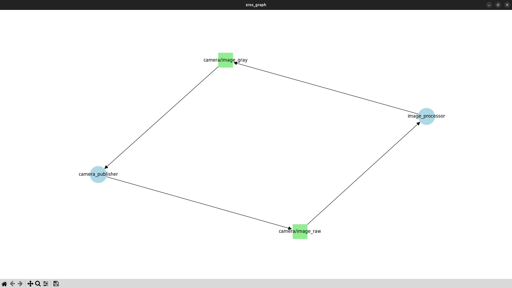

# Usage Guide

ZROS mimics the ROS 2 workflow but uses ZeroMQ for communication.

### Create a Publisher (publisher.py)
```python
from zros import Node, CvBridge
import cv2

class CameraPublisher(Node):
    def __init__(self):
        super().__init__("camera_pub")
        self.pub = self.create_publisher("video_topic")
        self.bridge = CvBridge()
        self.cap = cv2.VideoCapture(0)
        self.create_timer(1/60, self.timer_callback)

    def timer_callback(self):
        ret, frame = self.cap.read()
        if ret:
            # Payload is a dictionary
            msg = {
                "image": self.bridge.cv2_to_msg(frame),
                "info": "My Camera Frame"
            }
            self.pub.publish(msg)

if __name__ == "__main__":
    CameraPublisher().spin()
```

### Create a Subscriber (subscriber.py)
```python
from zros import Node, CvBridge
import cv2

class VideoSubscriber(Node):
    def __init__(self):
        super().__init__("video_sub")
        self.bridge = CvBridge()
        self.create_subscriber("video_topic", self.callback)

    def callback(self, payload):
        img = self.bridge.msg_to_cv2(payload["image"])
        cv2.imshow("Video", img)
        cv2.waitKey(1)

if __name__ == "__main__":
    VideoSubscriber().spin()
```

### Running Examples
You can find another examples in the `examples/` directory.

```bash
# Terminal 1
uv run zroscore

# Terminal 2
uv run publisher.py

# Terminal 3
uv run subscriber.py
```

## CLI Tools

ZROS provides command-line tools to inspect and interact with the system.

### zros_graph (Visualization)

Visualizes the active nodes and their connections (Publishers -> Topics -> Subscribers).

```bash
uv run zros_graph
```



### zros_pub (Publish)

Publishes a dictionary payload to a topic from the terminal.

**Syntax:**
```bash
uv run zros_pub <TOPIC> <DICTIONARY_STRING> [--rate <HZ>]
```

**Example:**
```bash
uv run zros_pub /my_topic "{'message': 'Hello from CLI', 'count': 42}" --rate 0.5
```
*Note: The input keys and values should be between single quotes.*

**Output:**
```
Publishing to /my_topic at 0.5 Hz: {'message': 'Hello from CLI', 'count': 42}
```

### zros_echo (Echo)

Prints messages received on a topic to the console.

**Syntax:**
```bash
uv run zros_echo <TOPIC>
```

**Example:**
```bash
uv run zros_echo /my_topic
```

**Output:**
```
Subscribed to /my_topic
{'message': 'Hello from CLI', 'count': 42}
{'message': 'Hello from CLI', 'count': 42}
...
```